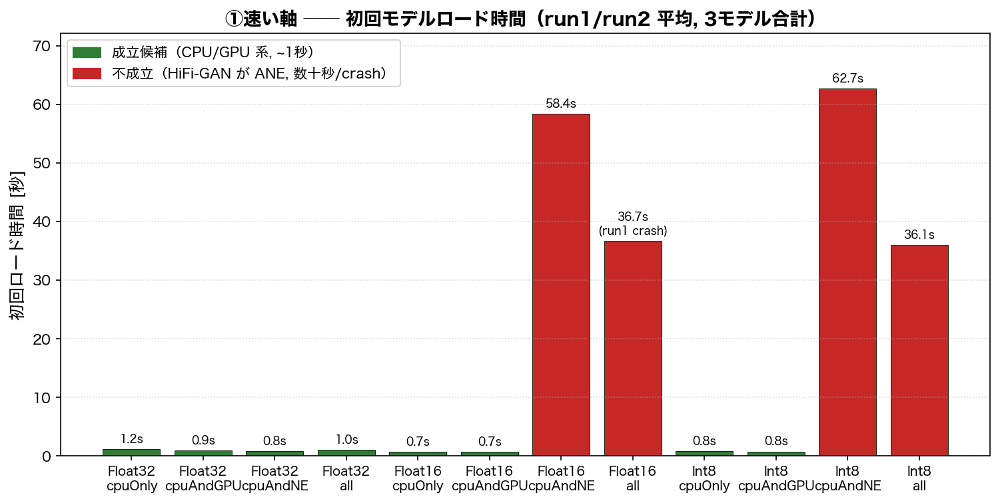
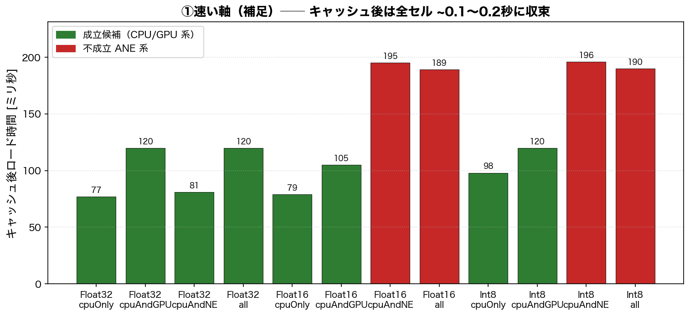
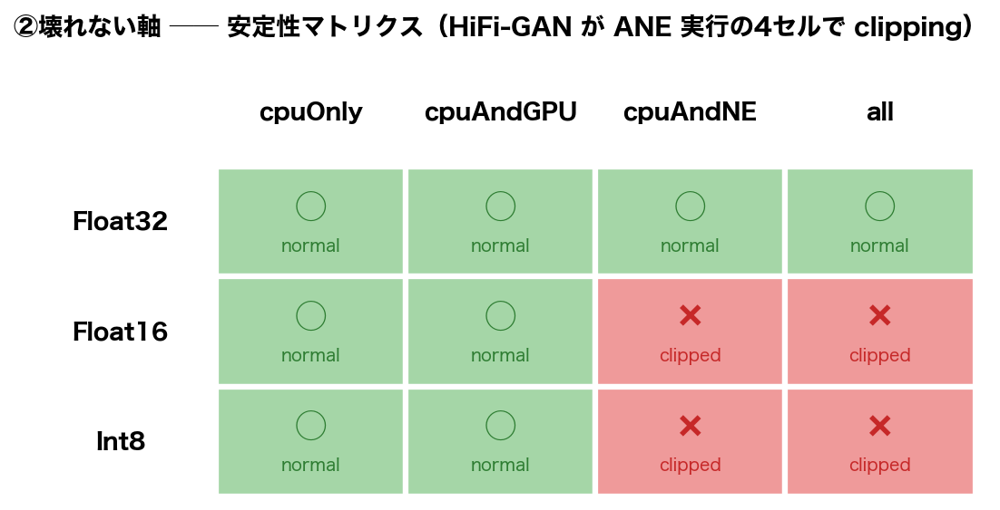
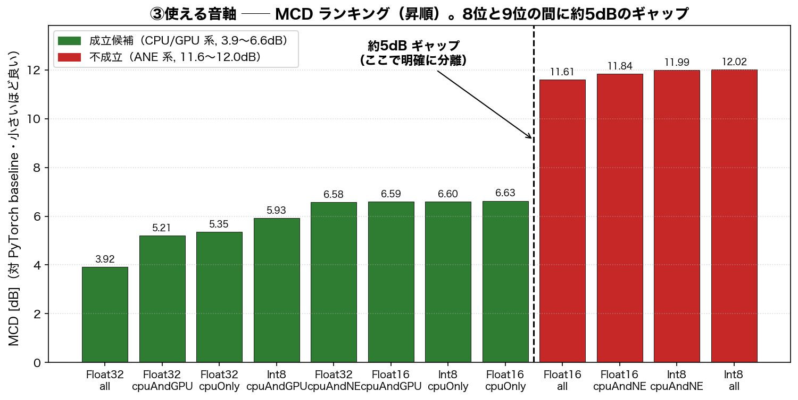
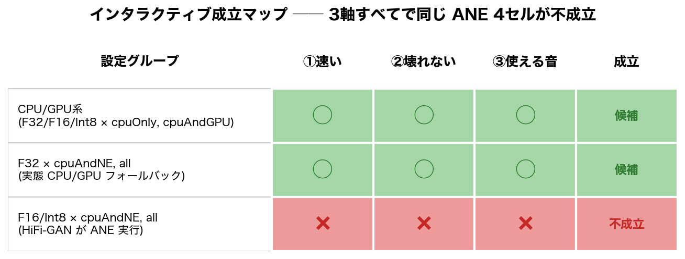

# PronounSEのiOS実機評価：インタラクティブな効果音生成の成立条件

## 1. 研究の目的

本研究の目的は、声真似から効果音を生成するPronounSEをiPhone単体で動作させ、スマホ上で「その場でインタラクティブに効果音を作る」体験が成立するかを検証することである。

PronounSEは、ユーザーの声真似を入力として効果音を生成するシステムである。しかし、従来の実行環境はPCやサーバーを前提としており、スマートフォン単体で同じように動作するかは明らかではない。特に、iOS上でCore MLを用いてモデルを実行する場合、モデル精度や計算ユニットの選択によって、速度・安定性・音質が大きく変わる可能性がある。

そこで本研究では、PronounSEをCore MLに変換し、iPhone実機上で複数のモデル精度と計算ユニットを比較した。評価の目的は、単にモデルが動くかどうかではなく、ユーザーがその場で試しながら効果音を生成できる条件を明らかにすることである。

## 2. 評価の考え方

本研究では、「インタラクティブな効果音生成が成立する」条件を、次の3軸で定義する。

| 軸      | 内容               | 指標                               |
| ------ | ---------------- | -------------------------------- |
| ① 速い   | ユーザーがその場で待てるか    | モデルロード時間 / 推論時間                  |
| ② 壊れない | 実行時に破綻しないか       | clipping / crash / E5RT / 初回非決定性 |
| ③ 使える音 | baselineに近い音が出るか | MCD / 聴感確認                       |

ここで重要なのは、速度だけではインタラクティブ性は判断できない点である。たとえ推論が速くても、音が壊れたり、アプリがクラッシュしたり、生成音がbaselineから大きく外れたりする場合、その条件は実用的とは言えない。したがって、本研究では3軸を同時に満たす条件を「成立候補」とする。

## 3. 実験条件

評価対象は、モデル精度3種類と計算ユニット4種類を組み合わせた12条件である。

| 精度      | 計算ユニット                               |
| ------- | ------------------------------------ |
| Float32 | cpuOnly / cpuAndGPU / cpuAndNE / all |
| Float16 | cpuOnly / cpuAndGPU / cpuAndNE / all |
| Int8    | cpuOnly / cpuAndGPU / cpuAndNE / all |

入力には同一の `input_sample.wav` を使用し、iPhone実機上で各条件のロード時間、安定性、出力音声を計測した。出力音声については、PyTorch版PronounSEの出力をbaselineとして、Core ML版の出力との差をMCDにより評価した。

## 4. ① 速い軸：モデルロード時間

モデルロード時間では、セルを選択してから音を出す準備ができるまでの時間を測定した。PronounSEでは、Encoder、Decoder、HiFi-GANの3モデルをロードする必要があるため、これらの合計時間を評価した。

結果として、CPU/GPU系の条件では初回ロードが約1秒前後に収まり、キャッシュ後は約0.1秒程度まで短縮された。一方、Float16およびInt8でNeural Engineを含む条件では、HiFi-GANの初回ロードに32〜67秒程度かかり、一部ではクラッシュも発生した。

| 条件                              |            初回ロード |      キャッシュ後 | 判定   |
| ------------------------------- | ---------------: | ----------: | ---- |
| CPU/GPU系                        |        約0.7〜1.2秒 | 約0.08〜0.12秒 | 成立候補 |
| Float16 / Int8 × cpuAndNE / all | 約32〜67秒、またはクラッシュ |      約0.19秒 | 不成立  |

この結果から、体感差を生む主な要因はキャッシュ後のロードではなく、初回の特殊化・コンパイル処理であることが分かった。特に、Float16およびInt8のHiFi-GANをANE向けに特殊化する処理が大きなボトルネックとなっていた。

なお、各セルを2回目以降ロードする（行き来する）場合は、下図のとおり全セルが約0.1〜0.2秒に収束する。体感差を生むのは各セルを初めて触った瞬間の初回特殊化のみである。

## 5. ② 壊れない軸：安定性

安定性評価では、各条件で出力波形がclippingしないか、アプリがクラッシュしないか、初回実行時に非決定的な破綻が起きないかを確認した。

結果として、Float16およびInt8でNeural Engineを含む条件では、決定論的なclippingが観測された。具体的には、F16 × cpuAndNE、F16 × all、Int8 × cpuAndNE、Int8 × all の4条件で、出力波形のRMSおよびpeakが大きく増加した。

一方、CPU/GPU系の条件では、概ねnormal_loudとして安定した出力が得られた。Float32 × cpuAndGPUでは単発初回にclippingが観測されたが、warm-upを入れることでmanual baselineと一致した。

各条件の安定性を一覧にすると下図のとおりで、Neural Engineを含むすべての条件が悪いわけではなく、Float16およびInt8のHiFi-GANがNeural Engineで実行される条件において、特に破綻が発生することが分かった。

## 6. ③ 使える音軸：MCDによる音質評価

音質評価では、PyTorch版PronounSEの出力をbaselineとし、各Core ML出力との距離をMCDで計測した。MCDは小さいほどbaselineに近い音色であることを示す。

結果として、CPU/GPU系の8条件はMCDが3.9〜6.6 dBに収まった。一方、Float16およびInt8でNeural Engineを含む4条件では、MCDが11.6〜12.0 dBまで悪化した。

| グループ                            |          MCD | 判定      |
| ------------------------------- | -----------: | ------- |
| CPU/GPU系8条件                     |   3.9〜6.6 dB | 使える音の候補 |
| Float16 / Int8 × cpuAndNE / all | 11.6〜12.0 dB | 不成立     |

特に重要なのは、良い8条件と悪い4条件の間に約5 dBのギャップがある点である。このため、MCDの結果からも、Float16およびInt8のANE実行条件は明確に棄却できる。

ただし、MCDは音色の距離を示す指標であり、人間が聞いたときの自然さや好みを完全に表すものではない。そのため、MCDは足切り指標として用い、最終的には聴感確認も行う必要がある。

## 7. 破綻箇所の切り分け

ANE条件で音が壊れる原因を調べるため、実機snapshotの中間出力を比較した。比較対象は、mel入力、encoder出力、postnet出力、HiFi-GAN出力波形、最終波形である。

その結果、mel、encoder、postnetまでは良い条件と壊れた条件でほぼ一致していた。一方、HiFi-GAN出力波形の段階でRMSが約4倍に増加し、最終波形ではclippingが発生していた。

| stage               | 状態         |
| ------------------- | ---------- |
| mel_normalized      | 正常         |
| encoder_output      | 正常         |
| postnet_output      | 正常         |
| waveform_predeemph  | RMSが約4倍に増加 |
| waveform_postdeemph | clipping   |

この結果から、破綻はencoderやdecoderではなく、主にHiFi-GAN vocoderをNeural Engineで実行した段階で発生していると考えられる。

ただし、本研究の主目的はHiFi-GANのANE内部挙動を低レイヤまで解明することではない。ここでの切り分けは、実用的な実行条件を選定するための補足的な分析である。

## 8. 成立マップ

3軸の評価結果をまとめると、次の成立マップのようになる。

この結果から、インタラクティブな効果音生成の成立候補はCPU/GPU系の条件に絞られる。Neural Engineを含む条件は必ずしも有利ではなく、特にFloat16およびInt8のHiFi-GANをANEで実行する場合、ロード時間、安定性、音質のすべてで不成立となった。

## 9. 考察

一般的には、Neural Engineを使うことで高速かつ省電力な推論が期待される。しかし、本研究の結果では、PronounSEのHiFi-GANにおいては、ANE実行が必ずしも適切ではなかった。

特に、Float16およびInt8のANE実行では、HiFi-GANの初回ロードに数十秒かかり、出力波形の振幅が大きく膨張し、MCDも大きく悪化した。このことから、音声生成モデル、とくに波形を直接生成するvocoderでは、計算ユニットの選択が出力品質に大きく影響する可能性がある。

一方で、CPU/GPU系の条件では、初回ロードが約1秒前後に収まり、安定性も高く、MCDも比較的低かった。そのため、PronounSEをiPhone上でインタラクティブに動かすには、現時点ではCPU/GPU実行を中心に採用する方が現実的である。

## 10. 結論

本研究では、声真似から効果音を生成するPronounSEをiPhone単体で実行し、インタラクティブな効果音生成が成立する条件を、速度・安定性・音質の3軸から評価した。

実験の結果、CPU/GPU系の条件では、ロード時間が約1秒前後に収まり、出力も安定し、MCDも3.9〜6.6 dBに収まった。一方、Float16およびInt8でNeural Engineを含む条件では、HiFi-GANのロードに数十秒かかり、clippingが発生し、MCDも11.6〜12.0 dBまで悪化した。

したがって、PronounSEのiOS実装において、Neural Engineは必ずしも最適な実行先ではない。特に、Float16およびInt8のHiFi-GANをANEで実行する条件は、速度・安定性・音質の3軸すべてを満たさなかった。現時点では、CPU/GPU系の実行条件が、スマホ単体でのインタラクティブな効果音生成に適した候補である。

## 11. 今後の課題

今後は、以下の点を確認する必要がある。

* 入力音声を増やし、CPU/GPU系8条件の順位をより信頼できるものにする
* MCDだけでなく、聴感評価やABXテストを行う
* 実際のアプリUI上で、ユーザーが複数候補を試聴・比較できる体験を検証する
* warm-upやキャッシュ戦略により、初回待ち時間をどこまで隠せるか検討する
* 最終的に採用する精度と計算ユニットを決定する
